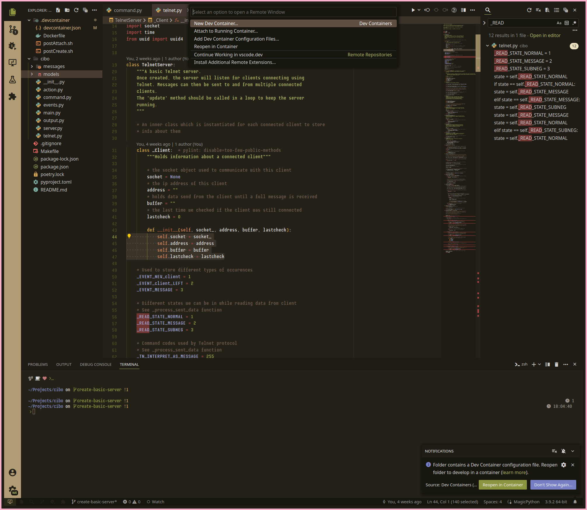

# Kohi

A coffee inspired theme for VS Code.

Earthy grounds, with a cheeky sprinkle of matcha.

## Preview



## Installation

Clone the repo to your VS Code extensions folder.

```bash
git clone https://github.com/wesker-albert/kohi-theme-vscode.git ~/.vscode/extensions/kohi-theme-vscode
```

## Documentation

- [CHANGELOG.md](CHANGELOG.md)